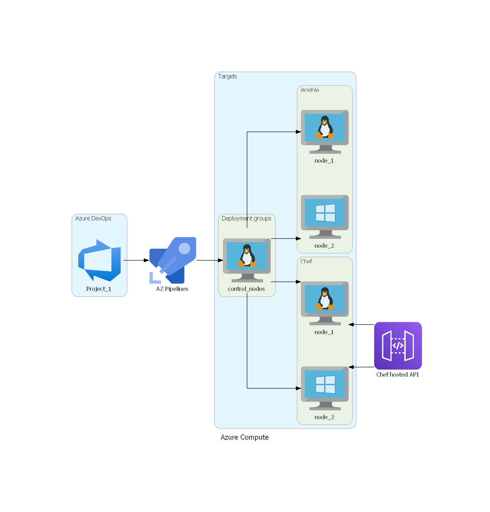

# Azure DevOps + Terraform + Ansible + Chef
### Let's leverage [Deployment groups](https://docs.microsoft.com/en-us/azure/devops/pipelines/release/deployment-groups/?view=azure-devops) inside ( Azure DevOps - Pipelines ) for apply configuration management by Ansible & Chef.

I'm assume that you're familiar with Azure DevOps and Terraform if not you can start from [here](https://medium.com/faun/lets-do-devops-build-an-azure-devops-terraform-pipeline-part-1-2-9ab301f3923c?), or visit https://cloudskills.io/blog where is plenty of useful information as well. That being said we have below the diagram of what we would like to reach.

Requirements:

* [Azure Subscription](https://azure.microsoft.com/en-us/free/)
* [Azure DevOps Account](https://azure.microsoft.com/en-us/services/devops/)
* [Chef Manage Account](https://manage.chef.io/login)

Once you have your Azure Pipeline setup with Terraform for cloud provisioning, we can start using the Bash script "devops.sh" under DevOps/post_deploy. The idea of this script is to use it as a CustomScript via [Microsoft.Azure.Extensions](https://docs.microsoft.com/en-us/azure/virtual-machines/extensions/features-windows). I've been heavily inspired by Maximilian Melcher's article on [melcher.dev](https://melcher.dev/2019/02/create-an-azure-devops-build/release-agent-with-terraform-ubuntu-edition/)

